**Universidade Lusófona de Humanidades e Tecnologias**

# Sistemas Móveis Empresariais - Laboratório 3

## Introdução

Neste laboratório iremos desenvolver uma aplicação em Flutter que permite criar, visualizar e modificar uma lista de filmes favoritos com o auxílio da tecnologia Firebase. Tal como no laboratório anterior, iremos utilizar o padrão [(BLoC)](https://bloclibrary.dev/#/) (Business Logic Component) para melhor gestão da lógica de todos os ecrãs constituintes da aplicação. Iremos introduzir também a tecnologia Firebase que nos permitirá alcançar o objetivo principal de persistência de dados numa base de dados na *Cloud*. Esta tecnologia está inserida na categoria de *BaaS (Backend As A Service)*, cuja premissa de utilização visa minimizar o *[Boilerplate](https://en.wikipedia.org/wiki/Boilerplate_code)* de criação de uma servidor capaz de responder aos pedidos de diversos clientes.

## Movies App

No final do laboratório é esperado que consigamos visualizar um ecrã de home semelhante ao da figura abaixo:

## Criação do projeto

Começemos pela criação de um projeto em Flutter com o auxílio da CLI.

~~~
flutter create sme_movies_app
~~~

Em seguida, devem abrir o Android studio na diretoria criada com a instrução acima.

## Firebase

O primeiro passo será a configuração de um projeto no Firebase. Para tal, devem aceder à [Firebase Console](https://console.firebase.google.com/) com um email de eleição vosso (gmail) e criar um projeto como demonstrada na figura abaixo:

    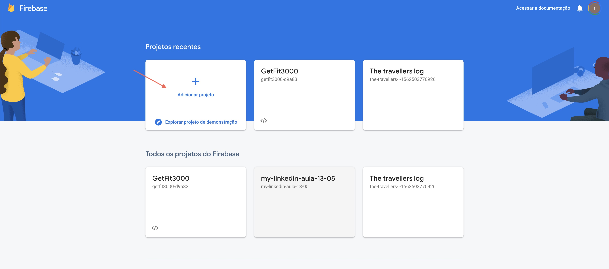

O nome do projeto fica ao critério do aluno, sugerindo algo como **sme-movies-app**.
Nos passos seguintes devem escolher a ativação do Google Analytics e conta *Default* do Firebase.

## Configuração do Firebase

Após a criação do projeto, na página home, é possível reparar nos ícones presentes na figura abaixo:

Devem clicar no correspondente ao sistema operativo em que estão a desenvolver, Android ou iOS.

    

### <u>Android</u>

Ao clicar no ícone do Android, será pedido para preencher configurações do projeto mobile. No caso de ser Android, a primeira configuração **Application ID** ou **Android package name**, foi criada automaticamente com a primeira instrução de linha de comandos que originou o projeto de Flutter, e por isso podemos consultar o mesmo aqui:

    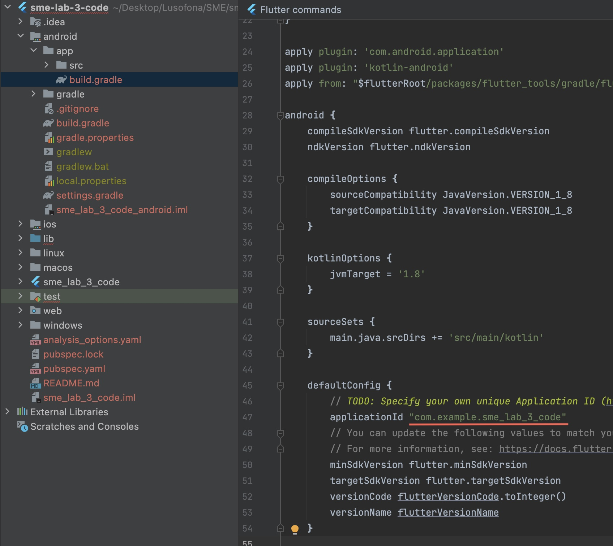

O **application Id** gerado pode ser modificado ao gosto do aluno, apenas temos de ter em atenção que este deve ser único, uma vez que na eventualidade de a aplicação ser partilhada na Google PlayStore, este será comparado com as aplicações existentes e no caso de existir uma outra aplicação com o mesmo applicationID, originará a um erro. Sugere-se a utilização do número de aluno da Lusófona como garantia, exemplo: **com.a22002234.sme_movies_app**.
Devem também modificar o campo **minSdkVersion** para 21, colmatando possíveis erros no decorrer do projeto e limitações.
De notar que esta mudança é uma das configurações mais importantes para se conseguir atingir o maior número de dispositivos Android compatíveis com a aplicação.

Em seguida, o **Application Name** pode ser algo mais amigável de se ler, como: **Movies App SME**.

O campo opcional **Debug signing certificate** apenas é utilizado em algumas exceções do Firebase, tais como **Social logins** da Google entre outros serviços. Como tal, podemos providenciar este campo no futuro caso necessitemos algumas destas funcionalidades, podendo prosseguir para o próximo passo.

Devem fazer download do ficheiro **google-services.json**:

    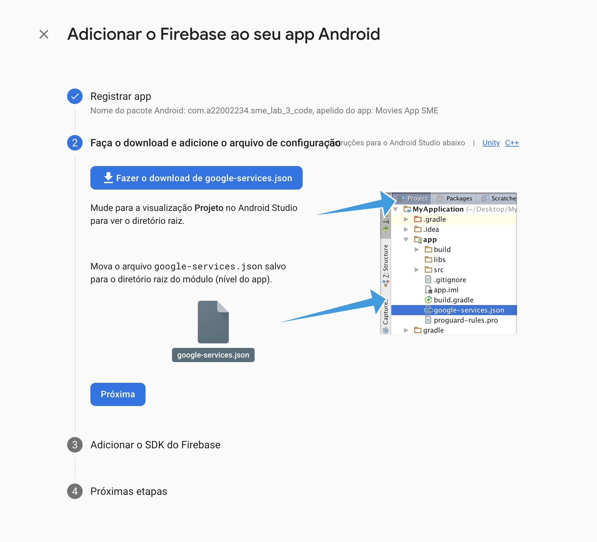

Este é o ficheiro mais importante para a configuração do Firebase SDK, contendo constantes e parameterizações para ser possivel connectar à Firebase desde o nosso projeto. O Firebase SDK necessita destas constantes para ser configurado.
Após o download do ficheiro devem colocar o mesmo na mesma diretoria onde se encontra o ficheiro **build.gradle**:

    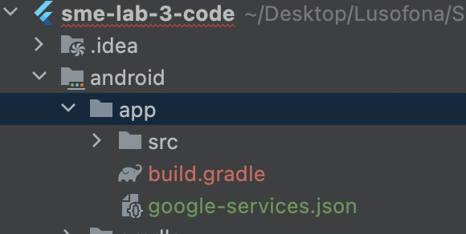

No próximo passo, adicionar o Firebase SDK ao projeto são necessárias mudanças nas configurações do projeto Android. Sendo que a primeira será no ficheiro **build.gradle** de raíz da pasta android (nome_do_projeto/android/build.gradle).

    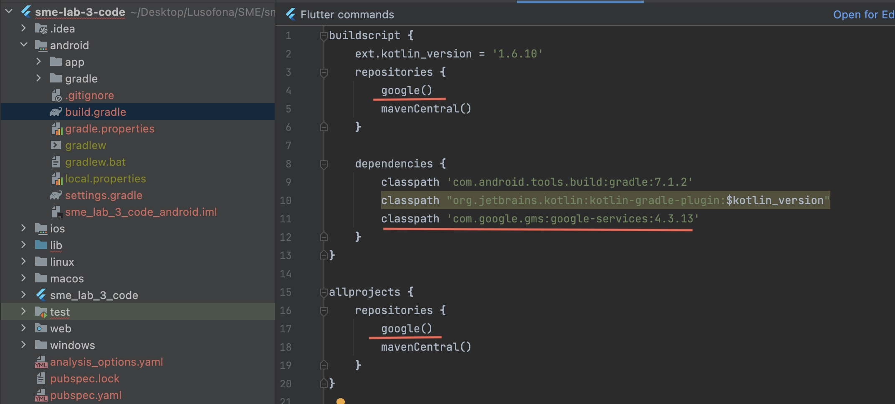

Em seguida, no ficheiro **build.gradle** do módulo a nível da app (nome_do_projeto/android/app/build.gradle), devem colocar as seguintes alterações:

    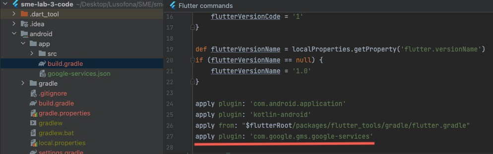

    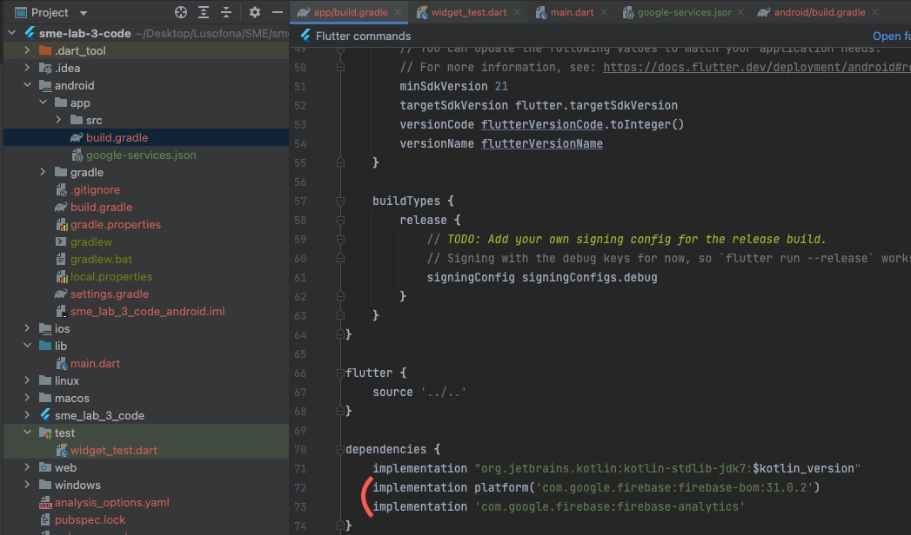

Em seguida na diretoria *root* do projeto, devem executar o comando:

~~~
flutter pub get
~~~

De forma a efetuar download de todas as dependencias relacionadas com o Flutter. Dá-se por terminada a configuração do Android e presentes na página *home* do Firebase Console.

### <u>iOS</u>

Ao clicar no ícone do iOS, será pedido para preencher configurações do projeto mobile. No caso de ser iOS, a primeira configuração **Bundle ID**, foi criada automaticamente com a primeira instrução de linha de comandos que originou o projeto de Flutter, e por isso podemos consultar o mesmo abrindo o projeto no *Xcode*. Podendo este ser aberto da seguinte forma:

    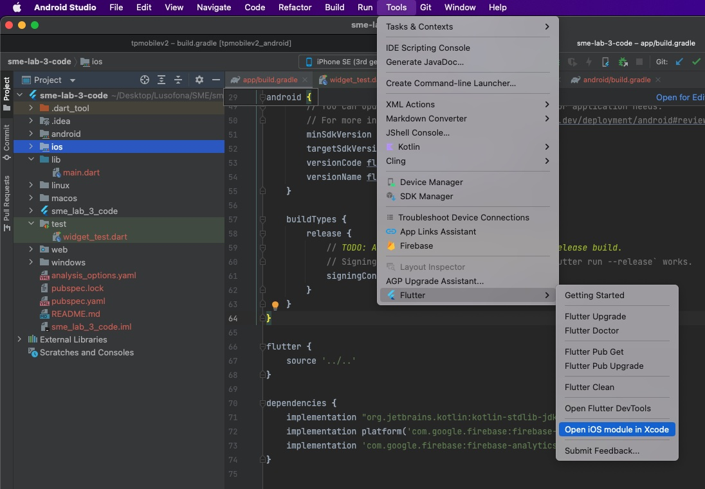

Acedendo ao menu de Tools do Android Studio. 
**<u>Nota:</u>** devem ter a pasta ios selecionada antes de abrir o menu das Tools para visualizar a opção *Open iOS module in Xcode*.
Sendo depois possível de visualizar o *bundle identifier* da seguinte forma:

    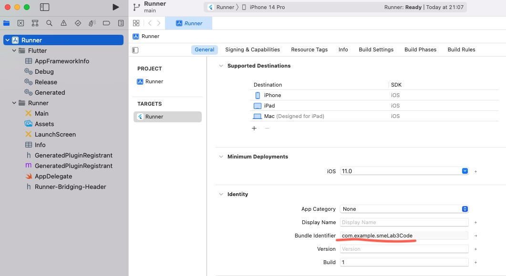

Preenchendo o primeiro campo com o valor indicado. O valor deste **bundle Id** pode ser modificado ao gosto do aluno, no entanto, este deve ser único, uma vez que partilhada na AppStore, é verificada a existência de aplicações com **bundle id's** iguais. 
Uma vez realizado este passo, devem fazer o download do ficheiro **GoogleService-info.plist** e colocar na pasta (ios/Runner).

    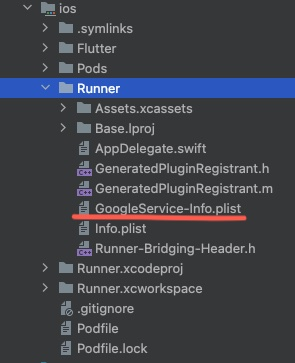

Após este passo, a configuração para iOS está completa uma vez que o comando 

~~~
flutter build ios
~~~

irá realizar todas as operações necessárias de configuração do Firebase SDK no sistema operativo e na aplicação.

## Instalar dependências

Uma vez que já se encontram realizados todos os passos para a configuração do Firebase SDK em cada uma das plataformas, necessitamos do software que efetivamente irá possibilitar as operações de acesso aos servios do Firebase desde a nossa aplicação. Para isso, recorremos às bibliotecas existentes do Firebase indicadas especialmente para o Flutter, estas podem ser verificadas no [Firebase Flutter](https://firebase.flutter.dev/).

No contexto do laboratório, apenas vamos precisar de 3 dependências: *firebase_core*, *cloud_firestore* e *firebase_auth*.

Devem executar os seguintes comandos:

~~~
flutter pub add firebase_core firebase_auth cloud_firestore
flutter pub get
~~~

Breve explicação dos comandos:

* O Flutter gere as suas dependências de software através a tool *pub*. Estas são configuradas através do ficheiro *pubspec.yaml* que contém todas as dependências do projeto listadas em *dependencies*.
* O primeiro comando adiciona estas dependências a este ficheiro abrindo o mesmo e conseguem verificar, inclusive a sua versão.
* O segundo comando é responsável pelo download destas, adicionando o código ao projeto para que seja utilizado.

No topo do ficheiro *main.dart* devem colocar o seguinte trecho de código, substituindo parte do já existente.

~~~
import 'package:flutter/material.dart';
import 'package:firebase_core/firebase_core.dart';

void main() async {
  WidgetsFlutterBinding.ensureInitialized();
  await Firebase.initializeApp();
  runApp(const MyApp());
}
~~~

O código presente no método *main* certifica-se que o Firebase SDK está corretamente configurado através do *Firebase.initializeApp()* que procura pelo ficheiro de configurações que efetuamos download aquando na configuração inicial da aplicação no Firebase (Google-services.json).
No entanto, esta inicialização está dependente de alguns componentes do Flutter que nem sempre estão prontos a serem utilizados e por isso, por vezes, acontecem problemas comuns de assincronismo, em que a utilização de componentes não terminados causa exceções e erros de runtime, não sendo este o resultado desejado, invocamos o método *in-built* do Flutter *WidgetsFlutterBinding.ensureInitialized()* que se certifica de esperar por todos estes componentes para futuramente serem utilizados sem erros.

**<u>Deve agora executar a aplicação no telemóvel ou emulador e verificar se tudo funciona sem erros.
</u>**

## Ecrã login

Seguindo o próximos passos, devem ter um ecrã semelhante ao seguinte:

Para a criação de este ecrã, são necessários os seguintes componentes:

* A criação de um formulário (Widget de apresentação);
* A criação de um estado do formulário (Informação do formulário);
* A criação de um *Cubit* (Lógica do formulário);
* A criação de uma estrutura de dados do utilizador (Classe User);
* Um *Repository* classe responsável por métodos de leitura e escrita na Firebase.

Antes de começar com o desenvolvimento dos componentes relacionados com o formulário, necessitamos de instalar mais umas dependências e por isso iremos executar os seguintes comandos, semelhantes aos executados em passos anteriores.

~~~
flutter pub add flutter_bloc bloc formz rxdart equatable
flutter pub get
~~~

Criemos o o ficheiro **authentication_repository.dart**. Em programação por camadas de apresentação (*Presentation Layer*), negócio (*Business Layer*) e dados (*Data Access Layer*), este insere-se na última camada de acesso e escrita de dados. No laboratório anterior criamos uma ficheiro com o sufixo *Source*, desta vez iremos utilizar o *Repository* e todas as classes que o tenham serão designadas somente para tratamento de dados.

~~~
import 'package:firebase_auth/firebase_auth.dart' as firebase_auth;

import 'user.dart';

class AuthenticationRepository {
  final firebase_auth.FirebaseAuth _firebaseAuth;
  final CacheClient _cache;

  static const userCacheKey = '__userCacheKey__';

  AuthenticationRepository(
      {firebase_auth.FirebaseAuth? firebaseAuth, CacheClient? cache})
      : _firebaseAuth = firebaseAuth ?? firebase_auth.FirebaseAuth.instance,
        _cache = cache ?? CacheClient();

  Stream<User> get user {
    return _firebaseAuth.authStateChanges().map((firebaseUser) {
      final user = firebaseUser == null ? User.empty : firebaseUser.toUser;
      _cache.write(key: userCacheKey, value: user);
      return user;
    });
  }

  User get currentUser {
    return _cache.read<User>(key: userCacheKey) ?? User.empty;
  }
}

extension on firebase_auth.User {
  User get toUser {
    return User(id: uid, email: email, name: displayName, photo: photoURL);
  }
}

class CacheClient {
  final Map<String, Object> _cache;

  CacheClient() : _cache = <String, Object>{};

  void write<T extends Object>({required String key, required T value}) {
    _cache[key] = value;
  }

  T? read<T extends Object>({required String key}) {
    final value = _cache[key];
    if (value is T) return value;
    return null;
  }
}
~~~

Vamos perceber o que está acontecer:

* Criou-se uma class AuthenticationRepository que tem um construtor com parâmetros opcionais e que caso não sejam providenciados, é atribuído um valor por omissão às suas variáveis final;
* É criado um método do tipo *getter* que devolve o valor do utilizador atualment autenticado no Firebase através do método da biblioteca *firabase_auth* o *authStateChanges()*. Este irá emitir valores a cada alteração do estado do utilziador autenticado e para melhor controlo sobre este valor, estamos a mapear o seu valor para uma estrutura de dados criada por nós que representa um utilziador, o *User*;
* Este mapeamento está a ser realizado através de um *extension*, que é uma funcionalidade do Flutter, permitindo adicionar operações a estruturas de dados já criadas. Neste caso em especifíco, estamos adicionar uma funcionalidade para mapear os valores da estrutura de dados existente do Firebase, a *firebase_auth.User*, para a nossa estrutura de dados *User*. Esta funcionalidade é um método do tipo *getter* chamado *toUser*. Sempre que recebemos um valor de *firebase_auth.User* referente ao Firebase, atribuimos valores correspondentes à estrutura de dados *User*;
* A classe *CacheClient* nada mais é do que uma classe organizadora de operações sobre um *Map*. Esta classe seré particularmente útil para gestão do estado atual de autenticação na aplicação que será utilizado no decorrer deste laboratório. Mais à frente iremos utilizar este *CacheClient*.

Falta-nos apenas a criação da estrutura de dados *User*. Criemos então um ficheiro **user.dart** e colcoar o seguinte conteúdo no mesmo:

~~~
import 'package:equatable/equatable.dart';

class User extends Equatable {

  const User({
    required this.id,
    this.email,
    this.name,
    this.photo,
  });

  final String? email;
  final String id;
  final String? name;
  final String? photo;

  static const empty = User(id: '');

  bool get isEmpty => this == User.empty;

  bool get isNotEmpty => this != User.empty;

  @override
  List<Object?> get props => [email, id, name, photo];
}
~~~

Asumimos que o utilizador tem apenas estas propriedades (email, nome, id e photo) com alguns métodos que auxiliam a lógica na aplicação.

Continuando a com a criação dos componentes do ecrã de Login, iremos prosseguir com o estado do formulário. Esta classe estará encarregada de conter os valores de cada campo do formulário, neste caso, para efetuarmos o login no Firebase, só precisaremos de dois campos: email e password.
Criemos primeiro as classes responsáveis pela validação dos campos do formulário.
Criemos então dois ficheiros **password.dart** e **email.dart** com o seguinte conteúdo respetivamente:

**password.dart**

~~~
import 'package:formz/formz.dart';

enum PasswordValidationError { invalid }

class Password extends FormzInput<String, PasswordValidationError> {
  static final _passwordRegex =
      RegExp(r'^[A-Za-z]{8,}');

  const Password.pure() : super.pure('');

  const Password.dirty(super.value) : super.dirty();

  @override
  PasswordValidationError? validator(String value) {
    return _passwordRegex.hasMatch(value ?? '')
        ? null
        : PasswordValidationError.invalid;
  }
}
~~~

**email.dart**

~~~
import 'package:formz/formz.dart';

enum EmailValidationError {
  invalid
}

class Email extends FormzInput<String, EmailValidationError> {

  static final RegExp _emailRegExp = RegExp(
    r'^[a-zA-Z0-9.!#$%&’*+/=?^_`{|}~-]+@[a-zA-Z0-9-]+(?:\.[a-zA-Z0-9-]+)*$',
  );

  const Email.pure() : super.pure('');
  
  const Email.dirty(super.value) : super.dirty();
  
  @override
  EmailValidationError? validator(String? value) {
    return _emailRegExp.hasMatch(value ?? '')
        ? null
        : EmailValidationError.invalid;
  }
}

~~~

Vamos perceber o que está acontecer:

* A dependência instalada no início do projeto *Formz* contém classes que ajudam na validação (*FormzInput*) que pode ser parametrizada com as estruturas de dados utéis para armazenamento e validação de valores;
* O método *validator* é responsável por fazer esta validação, sendo invocado pelo formulário a cada alteração do valor (mais à frente no laboratório iremos perceber como se processa);

Criemos agora o ficheiro de estado do formulário, **login_form_state.dart**.

~~~
import 'package:equatable/equatable.dart';
import 'package:formz/formz.dart';
import 'password.dart';

import 'email.dart';

class LoginFormState extends Equatable {
  final Email email;
  final Password password;
  final FormzStatus status;
  final String errorMessage;

  const LoginFormState(
      {this.email = const Email.pure(),
      this.password = const Password.pure(),
      this.status = FormzStatus.pure,
      this.errorMessage = ''});

  @override
  List<Object?> get props => [email, password, status];

  List<FormzInput> get inputs => [email, password];

  LoginFormState copyWith(
          {Email? email,
          Password? password,
          FormzStatus? status,
          String? errorMessage}) =>
      LoginFormState(
          email: email ?? this.email,
          password: password ?? this.password,
          status: status ?? this.status,
          errorMessage: errorMessage ?? this.errorMessage);
}

~~~

* Criou-se um construtor que permite receber valores como parâmetro e atribuir os mesmo respetivos a cada atributo. Estes têm também valores por omissão que, conceptualmente, significam o estado inicial de um campo do formulário, vazio, sem qualquer valor, ou seja, uma String vazia;
* O método *copyWith* é semelhante a um construtor, uma vez que devolve uma nova instância da classe, mas com a particularidade de apenas alterar o valor da propriedade que é passado como parâmetro. Este é prático quando queremos atualizar apenas uma das propriedades e modificar o estado do formulário;
* O *getter* inputs será utilizado para atualização do estado mais à frente. Em relação ao *props* é *overrided* para que a comparação == seja realizada com o auxílio deste *getter*.

Dos componentes necessários, falta-nos apenas dois. Passemos então para a a criação do ficheiro de lógica, *cubit*, que irá trabalhar sobre o *LoginFormState*. Crie o ficheiro **login_form_cubit.dart** e insira o seguinte trecho de código.

~~~
import 'package:bloc/bloc.dart';
import 'package:formz/formz.dart';
import 'package:sme_lab_3_code/password.dart';

import 'authentication_repository.dart';
import 'email.dart';
import 'login_form_state.dart';

class LoginFormCubit extends Cubit<LoginFormState> {
  final AuthenticationRepository _authenticationRepository;

  LoginFormCubit(this._authenticationRepository)
      : super(const LoginFormState());

  void emailChanged(String value) {
    final email = Email.dirty(value);
    List<FormzInput> inputs = [...state.inputs];
    inputs.remove(state.email);
    emit(state.copyWith(
        email: email, status: Formz.validate([...inputs, email])));
  }

  void passwordChanged(String value) {
    final password = Password.dirty(value);
    List<FormzInput> inputs = [...state.inputs];
    inputs.remove(state.password);
    emit(state.copyWith(
        password: password, status: Formz.validate([...inputs, password])));
  }

  Future<void> loginWithEmailPassword() async {
    if (!state.status.isValidated) return;
    emit(state.copyWith(status: FormzStatus.submissionInProgress));
    _authenticationRepository
        .loginWithEmailPassword(
            email: state.email.value, password: state.password.value)
        .then(
            (value) =>
                emit(state.copyWith(status: FormzStatus.submissionSuccess)),
            onError: (error) => emit(state.copyWith(
                errorMessage: error.toString(),
                status: FormzStatus.submissionFailure)));
  }
}
~~~

* O construtor inicia pela primeira vez o estado do formulário criando uma instância da classe *LoginFormState*, passando como parâmetro à classe pai *Cubit*;
* Os métodos *emailChanged* e *passwordChanged* criam uma nova instância do seu respetivo campo no formulário e emitem um novo valor através do método *emit*. Esta emissão será útil para invocar o método *build* dos widgets futuros para renderizarem os novos valores, por exemplo, a renderização de cada letra escrita no campo de email;
* O *AuthenticationRepository* é passado como parâmetro para que consigamos aceder aos métodos nele criados, estes têm acesso à Firebase. 
* O método *loginWithEmailPassword* invoca um outro método do *AuthenticationRepository* comunicando com o Firebase, enviando credenciais para que sejam validadas e por fim, autenticar.

Falta adicionar o método invocado no *AuthenticationRepository*, adicionemos o seguinte trecho de código ao ficheiro **authentication_repository.dart**:

~~~
(...)
Future<User?> loginWithEmailPassword(
      {required String email, required String password}) async {
    return _firebaseAuth
        .signInWithEmailAndPassword(email: email, password: password)
        .asStream()
        .map((user) => user.user?.toUser)
        .single;
  }
(...)
~~~

Por último, o *widget* de apresentação do formulário. Criemos o ficheiro **login_form.dart**

~~~
import 'package:flutter/material.dart';
import 'package:flutter_bloc/flutter_bloc.dart';
import 'package:formz/formz.dart';
import 'package:sme_lab_3_code/login_form_cubit.dart';
import 'package:sme_lab_3_code/login_form_state.dart';

class LoginForm extends StatelessWidget {
  const LoginForm({super.key});

  @override
  Widget build(BuildContext context) =>
      BlocListener<LoginFormCubit, LoginFormState>(
        listener: (context, state) {
          if (state.status.isSubmissionFailure) {
            ScaffoldMessenger.of(context)
              ..hideCurrentSnackBar()
              ..showSnackBar(SnackBar(
                  backgroundColor: Colors.red,
                  content: Text(state.errorMessage)));
          } else if (state.status.isSubmissionSuccess) {
            ScaffoldMessenger.of(context)
              ..hideCurrentSnackBar()
              ..showSnackBar(const SnackBar(
                  backgroundColor: Colors.green,
                  content: Text('Login successful')));
          }
        },
        child: SingleChildScrollView(
            child: Column(mainAxisSize: MainAxisSize.min, children: [
          const CircleAvatar(
            radius: 52,
            backgroundImage: NetworkImage(
                "https://cdn4.iconfinder.com/data/icons/google-i-o-2016/512/google_firebase-2-512.png"),
          ),
          const SizedBox(height: 16),
          _EmailInput(),
          const SizedBox(height: 8),
          _PasswordInput(),
          const SizedBox(height: 8),
          _LoginButton()
        ])),
      );
}

class _EmailInput extends StatelessWidget {
  @override
  Widget build(BuildContext context) =>
      BlocBuilder<LoginFormCubit, LoginFormState>(
          buildWhen: (previous, current) => previous.email != current.email,
          builder: (context, state) => TextFormField(
                key: const Key('login_form_email_key'),
                keyboardType: TextInputType.emailAddress,
                onChanged: (email) =>
                    context.read<LoginFormCubit>().emailChanged(email),
                decoration: InputDecoration(
                    border: const OutlineInputBorder(),
                    labelText: 'Email',
                    errorText: state.email.invalid ? 'Invalid email' : null),
              ));
}

class _PasswordInput extends StatelessWidget {
  @override
  Widget build(BuildContext context) => BlocBuilder<LoginFormCubit,
          LoginFormState>(
      buildWhen: (previous, current) => previous.password != current.password,
      builder: (context, state) => TextFormField(
            key: const Key("login_form_password_key"),
            onChanged: (password) =>
                context.read<LoginFormCubit>().passwordChanged(password),
            obscureText: true,
            decoration: InputDecoration(
                border: const OutlineInputBorder(),
                labelText: 'Password',
                errorText: state.password.invalid ? 'Invalid password' : null),
          ));
}

class _LoginButton extends StatelessWidget {
  @override
  Widget build(BuildContext context) => BlocBuilder<LoginFormCubit,
          LoginFormState>(
      buildWhen: (previous, current) => previous.status != current.status,
      builder: (context, state) => state.status.isSubmissionInProgress
          ? const CircularProgressIndicator()
          : ElevatedButton(
              style: ElevatedButton.styleFrom(
                  shape: RoundedRectangleBorder(
                      borderRadius: BorderRadius.circular(30)),
                  backgroundColor: Colors.green),
              onPressed: state.status.isValidated
                  ? () =>
                      context.read<LoginFormCubit>().loginWithEmailPassword()
                  : null,
              child: const Text('Login')));
}

~~~

* *BlocBuilder* é um objeto utilizado para renderizar *widgets* baseado no estado (*LoginFormstate*) atual. Neste caso, é utilizado para rederizar os componentes visuais constituintes do *LoginForm*. Este contém um parâmetro, *buildWhen*, que recebe uma função anónima que devolve uma condição booleana indicado se o *widget* deve ser renderizado novamente com novos valores.
* *BlocListener* escuta apenas o *state*, e pode executar operações com base no mesmo. O objetivo final não é renderizar o *widget* sempre que há uma alteração, mas sim poder fazer outro tipo de operações assincronas como chamadas a API;
* O *context* é dos elementos mais importantes do Flutter, contendo informação geral da aplicação, sendo o elo de ligação entre o encadeamento de *widgets* constituintes da aplicação na sua respetiva àrvore;
* Sempre que utilizamos um dos objetos *BlocListener* ou *BlocBuilder*, o contexto é atualizado e por isso temos acesso ao que foi criado;

Vamos agora alterar parte do ficheiro **main.dart** para o seguinte:

~~~
import 'package:flutter/material.dart';
import 'package:firebase_core/firebase_core.dart';
import 'package:flutter_bloc/flutter_bloc.dart';
import 'package:sme_lab_3_code/authentication_repository.dart';
import 'package:sme_lab_3_code/login_form.dart';

import 'login_form_cubit.dart';

void main() async {
  WidgetsFlutterBinding.ensureInitialized();
  await Firebase.initializeApp();
  final authenticationRepository = AuthenticationRepository();
  await authenticationRepository.user.first;

  runApp(MyApp(authenticationRepository: authenticationRepository));
}

class MyApp extends StatelessWidget {
  final AuthenticationRepository _authenticationRepository;

  MyApp({super.key, required AuthenticationRepository authenticationRepository})
      : _authenticationRepository = authenticationRepository;

  // This widget is the root of your application.
  @override
  Widget build(BuildContext context) => RepositoryProvider.value(
        value: _authenticationRepository,
        child: BlocProvider<LoginFormCubit>(
          create: (_) => LoginFormCubit(_authenticationRepository),
          child: const MyHomePage(),
        ),
      );
}

class MyHomePage extends StatelessWidget {
  const MyHomePage({super.key});

  @override
  Widget build(BuildContext context) => MaterialApp(
        title: 'Movies App',
        home: Scaffold(
          appBar: AppBar(title: const Text("Movies App")),
          body: const Padding(
            padding: EdgeInsets.all(16),
            child: LoginForm(),
          ),
        ),
        theme: ThemeData(
          primarySwatch: Colors.green,
        ),
      );
}
~~~

* *BlocProvider* permite criar uma instância da classe *LoginFormCubit* e adicioná-la ao context para que seja utilizada na *widget tree*. Assim, todos os elementos de *Bloc* nos *widgets* previamente criados têm acesso à lógica do formulário através do *context.read()*;
* No método *main*, invocamos o *getter* (user) do *AuthenticationRepository* de forma a abrir um túnel de eventos do estado da autenticação proveniente do Firebase, obtendo assim informação necessária para realizar operações na aplicação;
* *RepositoryProvider* tem um objetivo semelhante ao *BlocProvider*, colocando a instânica do *AuthenticationRepository* disponível para toda a aplicação também essa através do *context*;

Após esta alteração, o ecrã atual, deve estar semelhante à seguinte imagem:

    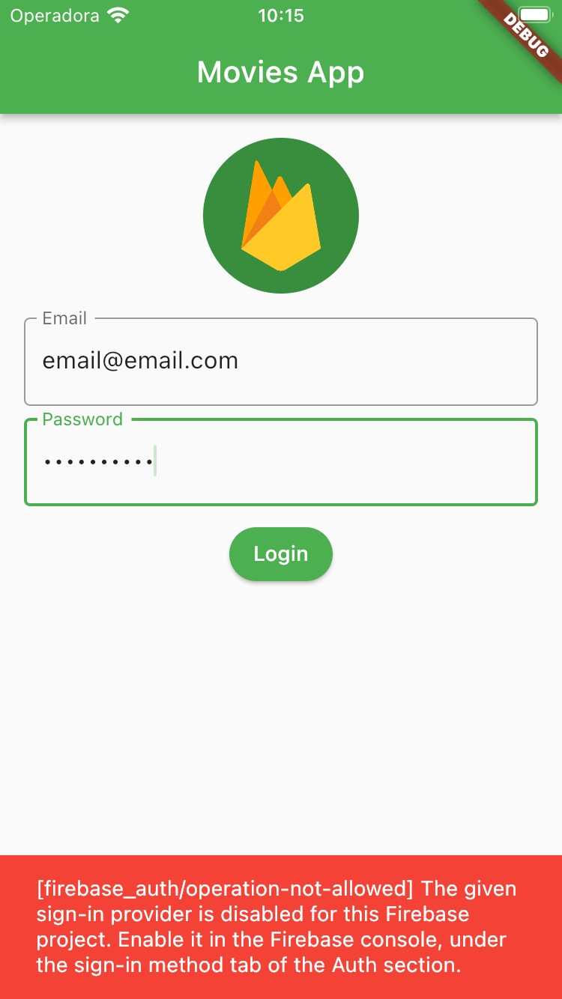

Ao tentar realizar o login, com qualquer tipo de valores de autenticação, obtém-se um erro. Este indica-nos a necessidade de ativação do serviços de autenticação da Firebase. 
Em qualquer tipo de serviços da Firebase, o seu funcionamente está dependente de uma pré-configuração.
Devem aceder ao ecrã de home da Firebase Console e no menu lateral, clicar em **<u>Authentication</u>** e depois **E-mail/Senha**:

    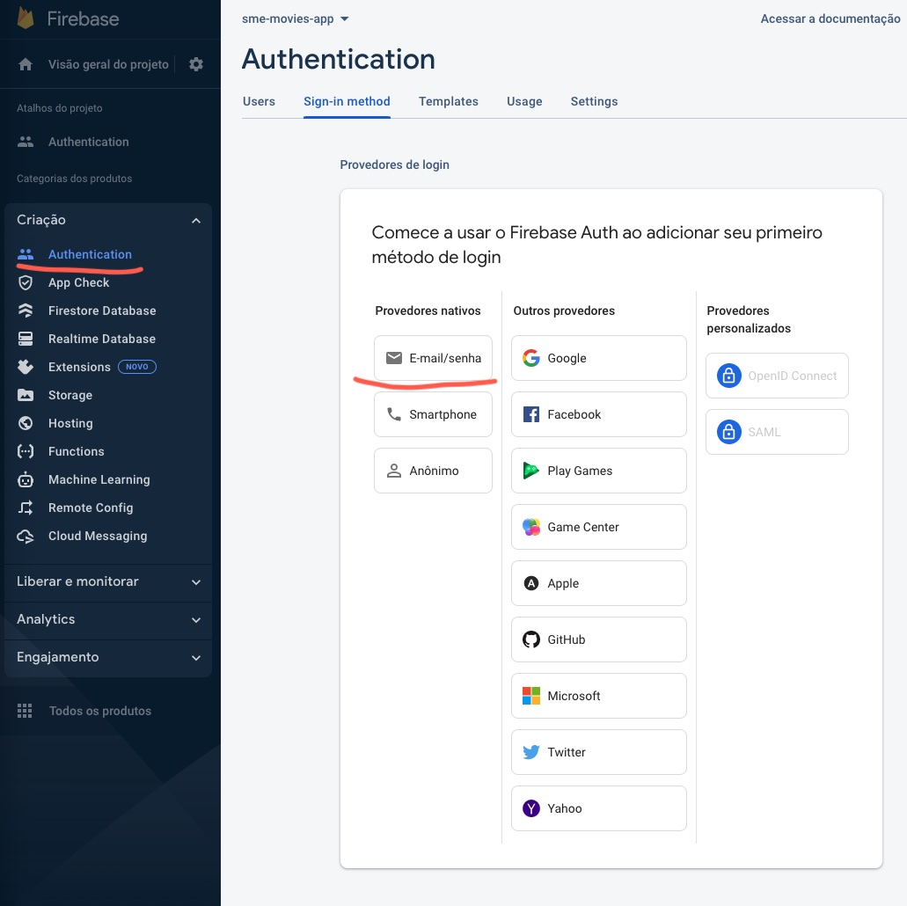

Em seguida ativar este tipo de autenticação. Este é o ponto principal de ativação para outros tipos de autenticação, tais como Google SignIn, Facebook SignIn, Telemóvel, Twitter, entre outros possíveis.

Experimentando novamente a aplicação com credenciais aleatórias, podemos verificar que o erro mostrado é diferente:

    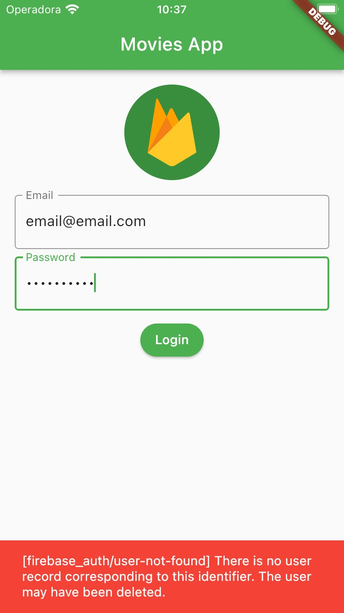

## Ecrã Registo

Percebemos que está efetivamente a funcionar uma vez que nos indica que não existe este utilizador no Firebase, isto leva-nos ao próximo passo de criação do ecrã de registo. Iremos seguir os mesmos passos de criação de um formulário:

* Criação do ficheiro de estado;
* Criação do ficheiro de lógica;
* Criação do ficheiro de apresentação.

Aproveitemos esta fase para organizar a estrutura de pastas do projeto:

~~~
├── form_fields
│   ├── email.dart
│   └── password.dart
├── login
│   ├── login_form.dart
│   ├── login_form_cubit.dart
│   └── login_form_state.dart
├── main.dart
├── models
│   └── user.dart
├── register
└── repository
    └── authentication_repository.dart
~~~

Criemos então agora os ficheiros do formulário de registo.

**register_form_state.dart** na pasta register:

~~~
import 'package:equatable/equatable.dart';
import 'package:formz/formz.dart';
import '../form_fields/confirmed_password.dart';
import '../form_fields/password.dart';
import '../form_fields/email.dart';

class RegisterFormState extends Equatable {
  final Email email;
  final Password password;
  final ConfirmedPassword confirmedPassword;
  final FormzStatus status;
  final String? errorMessage;

  const RegisterFormState(
      {this.email = const Email.pure(),
      this.password = const Password.pure(),
      this.confirmedPassword = const ConfirmedPassword.pure(),
      this.status = FormzStatus.pure,
      this.errorMessage});

  @override
  List<Object?> get props => [email, password, confirmedPassword, status];
  
  List<FormzInput> get inputs => [email, password, confirmedPassword];

  RegisterFormState copyWith(
          {Email? email,
          Password? password,
          ConfirmedPassword? confirmedPassword,
          FormzStatus? status,
          String? errorMessage}) =>
      RegisterFormState(
          email: email ?? this.email,
          password: password ?? this.password,
          confirmedPassword: confirmedPassword ?? this.confirmedPassword,
          status: status ?? this.status,
          errorMessage: errorMessage ?? this.errorMessage);
}
~~~

**confirmed_password.dart** na pasta form_fields:

~~~
import 'package:formz/formz.dart';

enum ConfirmedPasswordValidationError { invalid }

class ConfirmedPassword
    extends FormzInput<String, ConfirmedPasswordValidationError> {
  final String password;

  const ConfirmedPassword.pure({this.password = ''}) : super.pure('');

  const ConfirmedPassword.dirty({required this.password, String value = ''})
      : super.dirty(value);

  @override
  ConfirmedPasswordValidationError? validator(String value) {
    return password == value ? null : ConfirmedPasswordValidationError.invalid;
  }
}
~~~

**register_form_cubit.dart** na pasta register:

~~~
import 'package:bloc/bloc.dart';
import 'package:formz/formz.dart';
import 'package:sme_lab_3_code/form_fields/confirmed_password.dart';
import 'package:sme_lab_3_code/register/register_form_state.dart';

import '../form_fields/email.dart';
import '../form_fields/password.dart';
import '../repository/authentication_repository.dart';

class RegisterFormCubit extends Cubit<RegisterFormState> {
  final AuthenticationRepository _authenticationRepository;

  RegisterFormCubit(this._authenticationRepository)
      : super(const RegisterFormState());

  void emailChanged(String value) {
    final email = Email.dirty(value);
    List<FormzInput> inputs = [...state.inputs];
    inputs.remove(state.email);
    emit(state.copyWith(
        email: email, status: Formz.validate([...inputs, email])));
  }

  void passwordChanged(String value) {
    final password = Password.dirty(value);
    final confirmedPassword = ConfirmedPassword.dirty(
        password: password.value, value: state.confirmedPassword.value);
    List<FormzInput> inputs = [...state.inputs];
    inputs.remove(state.password);
    inputs.remove(state.confirmedPassword);
    emit(state.copyWith(
        password: password,
        confirmedPassword: confirmedPassword,
        status: Formz.validate([...inputs, password, confirmedPassword])));
  }

  void confirmedPasswordChanged(String value) {
    final confirmedPassword =
        ConfirmedPassword.dirty(value: value, password: state.password.value);
    List<FormzInput> inputs = [...state.inputs];
    inputs.remove(state.confirmedPassword);
    emit(state.copyWith(
        confirmedPassword: confirmedPassword,
        status: Formz.validate([...inputs, confirmedPassword])));
  }

  Future<void> registerFormSubmit() async {
    if (!state.status.isValidated) return;
    emit(state.copyWith(status: FormzStatus.submissionInProgress));
    _authenticationRepository
        .createUserWithEmailPassword(
            email: state.email.value, password: state.password.value)
        .then(
            (value) =>
                emit(state.copyWith(status: FormzStatus.submissionSuccess)),
            onError: (error) => emit(state.copyWith(
                errorMessage: error.toString(),
                status: FormzStatus.submissionFailure)));
  }
}
~~~

Adicionemos o trecho de código ao **authentication_repository.dart**:

~~~
(...)
Future<User?> createUserWithEmailPassword(
          {required String email, required String password}) =>
      _firebaseAuth
          .createUserWithEmailAndPassword(email: email, password: password)
          .asStream()
          .map((user) => user.user?.toUser)
          .single;
(...)
~~~

Por último, criemos o ficheiro **register_form.dart** na pasta register:

~~~
import 'package:flutter/material.dart';
import 'package:flutter_bloc/flutter_bloc.dart';
import 'package:formz/formz.dart';
import 'package:sme_lab_3_code/register/register_form_cubit.dart';
import 'package:sme_lab_3_code/register/register_form_state.dart';

class RegisterForm extends StatelessWidget {
  const RegisterForm({super.key});

  @override
  Widget build(BuildContext context) =>
      BlocListener<RegisterFormCubit, RegisterFormState>(
        listener: (context, state) {
          if (state.status.isSubmissionSuccess) {
              ScaffoldMessenger.of(context)
              ..hideCurrentSnackBar()
              ..showSnackBar(
                  const SnackBar(
                      backgroundColor: Colors.green,
                      content:
                      Text('Create account successful')));
            Navigator.of(context).pop();
          } else if (state.status.isSubmissionFailure) {
            ScaffoldMessenger.of(context)
              ..hideCurrentSnackBar()
              ..showSnackBar(
                SnackBar(
                    backgroundColor: Colors.red,
                    content:
                        Text(state.errorMessage ?? 'Create account failed')),
              );
          }
        },
        child: Column(
          mainAxisSize: MainAxisSize.min,
          children: [
            const CircleAvatar(
              radius: 52,
              backgroundImage: NetworkImage(
                  "https://cdn4.iconfinder.com/data/icons/google-i-o-2016/512/google_firebase-2-512.png"),
            ),
            const SizedBox(height: 16),
            _EmailInput(),
            const SizedBox(height: 8),
            _PasswordInput(),
            const SizedBox(height: 8),
            _ConfirmPasswordInput(),
            const SizedBox(height: 8),
            _SignUpButton(),
          ],
        ),
      );
}

class _EmailInput extends StatelessWidget {
  @override
  Widget build(BuildContext context) {
    return BlocBuilder<RegisterFormCubit, RegisterFormState>(
      buildWhen: (previous, current) => previous.email != current.email,
      builder: (context, state) {
        return TextField(
          key: const Key('register_form_email'),
          onChanged: (email) =>
              context.read<RegisterFormCubit>().emailChanged(email),
          keyboardType: TextInputType.emailAddress,
          decoration: InputDecoration(
            border: const OutlineInputBorder(),
            labelText: 'Email',
            helperText: '',
            errorText: state.email.invalid ? 'invalid email' : null,
          ),
        );
      },
    );
  }
}

class _PasswordInput extends StatelessWidget {
  @override
  Widget build(BuildContext context) {
    return BlocBuilder<RegisterFormCubit, RegisterFormState>(
      buildWhen: (previous, current) => previous.password != current.password,
      builder: (context, state) {
        return TextField(
          key: const Key('register_form_password'),
          onChanged: (password) =>
              context.read<RegisterFormCubit>().passwordChanged(password),
          obscureText: true,
          decoration: InputDecoration(
            border: const OutlineInputBorder(),
            labelText: 'Password',
            helperText: '',
            errorText: state.password.invalid ? 'invalid password' : null,
          ),
        );
      },
    );
  }
}

class _ConfirmPasswordInput extends StatelessWidget {
  @override
  Widget build(BuildContext context) {
    return BlocBuilder<RegisterFormCubit, RegisterFormState>(
      buildWhen: (previous, current) =>
          previous.password != current.password ||
          previous.confirmedPassword != current.confirmedPassword,
      builder: (context, state) {
        return TextField(
          key: const Key('register_form_confirm_password'),
          onChanged: (confirmPassword) => context
              .read<RegisterFormCubit>()
              .confirmedPasswordChanged(confirmPassword),
          obscureText: true,
          decoration: InputDecoration(
            border: const OutlineInputBorder(),
            labelText: 'Confirm password',
            helperText: '',
            errorText: state.confirmedPassword.invalid
                ? 'passwords do not match'
                : null,
          ),
        );
      },
    );
  }
}

class _SignUpButton extends StatelessWidget {
  @override
  Widget build(BuildContext context) {
    return BlocBuilder<RegisterFormCubit, RegisterFormState>(
      buildWhen: (previous, current) => previous.status != current.status,
      builder: (context, state) {
        return state.status.isSubmissionInProgress
            ? const CircularProgressIndicator()
            : ElevatedButton(
                key: const Key('register_form_create_button'),
                style: ElevatedButton.styleFrom(
                  shape: RoundedRectangleBorder(
                    borderRadius: BorderRadius.circular(30),
                  ),
                  backgroundColor: Colors.orangeAccent,
                ),
                onPressed: state.status.isValidated
                    ? () =>
                        context.read<RegisterFormCubit>().registerFormSubmit()
                    : null,
                child: const Text('Create account'),
              );
      },
    );
  }
}
~~~

Temos todos os ficheiros/código necessário para tornar uma página de registo visível, no entanto, as peças não estão ligadas! Continuamos apenas com o ecrã de *Login* na aplicação sem qualquer tipo de interação nova para apresentar a página de Registo.

Modifiquemos então o ficheiro **login_form.dart** para conter o seguinte:

~~~
(...)
class LoginForm extends StatelessWidget {
  const LoginForm({super.key});

  @override
  Widget build(BuildContext context) =>
      BlocListener<LoginFormCubit, LoginFormState>(
        listener: (context, state) {
          if (state.status.isSubmissionFailure) {
            ScaffoldMessenger.of(context)
              ..hideCurrentSnackBar()
              ..showSnackBar(SnackBar(
                  backgroundColor: Colors.red,
                  content:
                      Text(state.errorMessage ?? 'Authentication Failure')));
          }
        },
        child: SingleChildScrollView(
            child: Column(mainAxisSize: MainAxisSize.min, children: [
          const CircleAvatar(
            radius: 52,
            backgroundImage: NetworkImage(
                "https://cdn4.iconfinder.com/data/icons/google-i-o-2016/512/google_firebase-2-512.png"),
          ),
          const SizedBox(height: 16),
          _EmailInput(),
          const SizedBox(height: 8),
          _PasswordInput(),
          const SizedBox(height: 8),
          _LoginButton(),
          const SizedBox(height: 8),
          _SignUpButton()
        ])),
      );
}
(...)

(...)
class _SignUpButton extends StatelessWidget {
  @override
  Widget build(BuildContext context) => TextButton(
        key: const Key('login_form_register_button'),
        onPressed: () => Navigator.of(context).push<void>(RegisterPage.route()),
        style: TextButton.styleFrom(backgroundColor: Colors.amberAccent),
        child: const Text('Create account'),
      );
}
(...)
~~~

* O botão de registo presente no formulário agora, tem como ação invocar um método do *Navigator*. O *Navigator* é o elemento do Flutter que permite a utilização de rotas, ou *routes* para visualizar novas páginas;
* O *Navigator* permite também a simulação de outros tipos de componentes, como *Dialogs*, *Modals*, componentes que habitualmente são utilizados para apresentação de informação sem muita interação, por exemplo, informação de um utilizador, informação de um elemento de uma lista, entre outras. No contexto deste laboratório, será pedido para apresentar um *Dialog* com informação de um filme;

Passemos então ao *widget* da página de Registo. Devem criar o ficheiro **register_page.dart** dentro da pasta register e colocar o seguinte conteúdo:

~~~
import 'package:flutter/material.dart';
import 'package:flutter_bloc/flutter_bloc.dart';
import 'package:sme_lab_3_code/register/register_form.dart';
import 'package:sme_lab_3_code/register/register_form_cubit.dart';
import 'package:sme_lab_3_code/repository/authentication_repository.dart';

class RegisterPage extends StatelessWidget {
  const RegisterPage({super.key});

  static Route<void> route() {
    return MaterialPageRoute<void>(builder: (_) => const RegisterPage());
  }

  @override
  Widget build(BuildContext context) => Scaffold(
      appBar: AppBar(title: const Text("Create account")),
      body: Padding(
        padding: const EdgeInsets.all(16),
        child: BlocProvider<RegisterFormCubit>(
          create: (_) =>
              RegisterFormCubit(context.read<AuthenticationRepository>()),
          child: const RegisterForm(),
        ),
      ));
}
~~~

* Importante perceber que temos o context da primeira página onde se utilizou o *RepositoryProvider* para providênciar a instância do *AuthenticationRepository* e assim é possível de aceder na *widget tree*.

Os ecrã atuais devem ser algo parecido com os seguintes:

    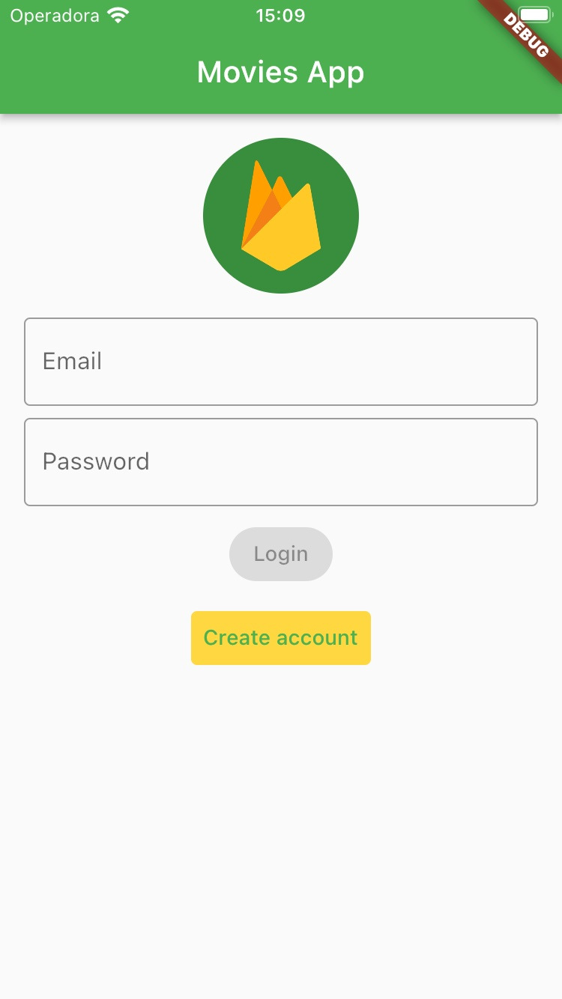
    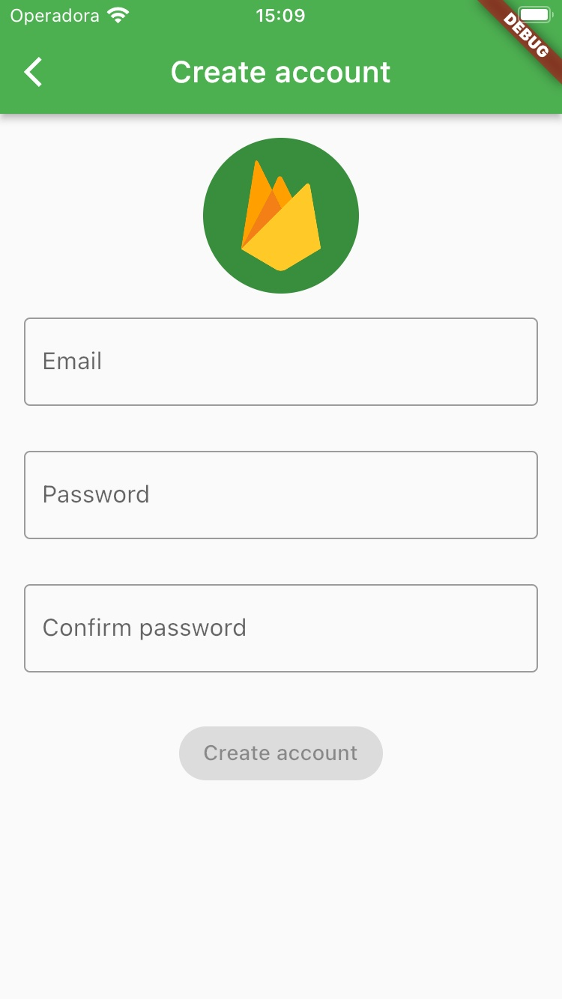

Devem então verificar se o ecrã de registo está a funcionar corretamente, criando uma conta e visualizando a mesma no menu de *users* do serviços de autenticação da Firebase:

    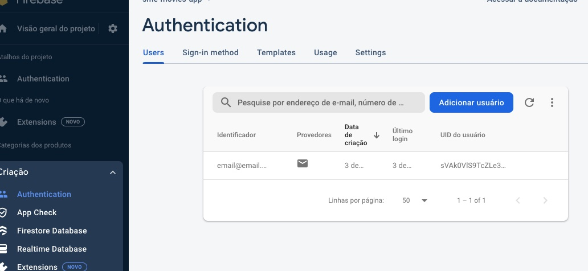

## Ecrã Movies

Passando à última parte do laboratório, a criação do ecrã que lista os *movies* existentes num banco de dados da Firebase. Para a utilização deste banco de dados, o processo é semelhante ao da autenticação e necessária a ativação do serviço. Para isso acedemos ao menu lateral da página home da Firebase Console, e clicamos em **Firebase Database**:

* Escolha criar bandos de dados;
* Escolha o modo de produção;
* Ative o banco de dados;
* Aceda à tab regras/rules e coloque o seguinte:

~~~
rules_version = '2';
service cloud.firestore {
  match /databases/{database}/documents {
    match /{document=**} {
      allow read, write: if request.auth != null;
    }
  }
}
~~~

Estamos aplicar uma regra para que os nossos dados apenas sejam acessíveis se estivermos autenticados, adicionando assim uma camada de segurança para os dados que iremos inserir.

Na página home do Firebase Database, devem criar uma coleção chamada *movies* e inserir um movie com os seguintes campos:

    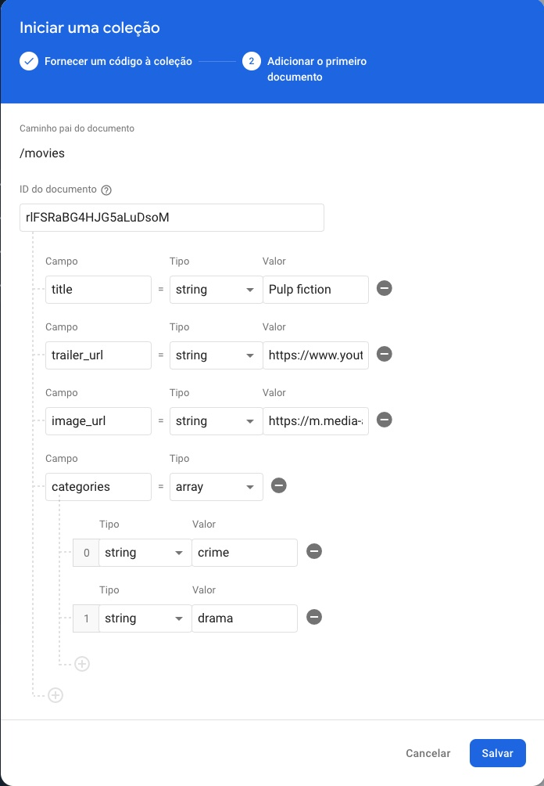

* Os dados do filme pode ser à escolha do aluno, devem apenas seguir a mesma lógica da estrutura de dados;
* O Firestore Database é um tipo de banco de dados que se conheçe por NoSQL. Este bancos de dados não especificam regras de relação entre registos (Foreign keys, Primary keys);
* Os tipos de dados de cada campo podem ser desde primitivos a compostos (Objetos);
* Sempre que é adicionado um novo elemento a uma coleção, é atribuido um identificador único, possível de verificar na imagem abaixo.

    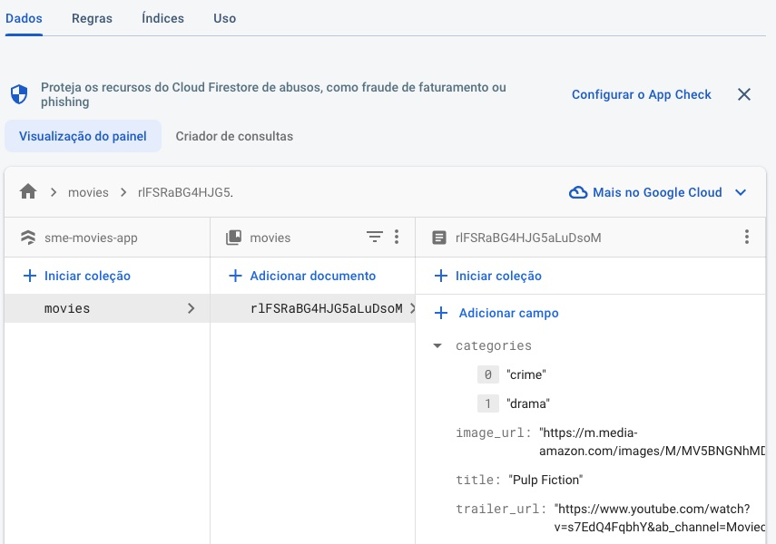

Criemos então uma *Movies Page* que irá listar todos os elementos presentes na coleção *movies*.

~~~
├── form_fields
│   ├── confirmed_password.dart
│   ├── email.dart
│   └── password.dart
├── login
│   ├── login_form.dart
│   ├── login_form_cubit.dart
│   └── login_form_state.dart
├── main.dart
├── models
│   └── user.dart
├── movies
│   └── movies_page.dart
├── register
│   ├── register_form.dart
│   ├── register_form_cubit.dart
│   ├── register_form_state.dart
│   └── register_page.dart
└── repository
    └── authentication_repository.dart
~~~

Nova pasta criada **movies** com o ficheiro **movies.dart** que será o ponto de entrada da nova página. Com o seguinte trecho de código:

~~~
import 'package:flutter/material.dart';
import 'package:flutter_bloc/flutter_bloc.dart';

import '../repository/movies_repository.dart';

class MoviesPage extends StatelessWidget {
  const MoviesPage({super.key});

  static Route<void> route() {
    return MaterialPageRoute<void>(builder: (_) => const MoviesPage());
  }

  @override
  Widget build(BuildContext context) => RepositoryProvider(
      create: (_) => MoviesRepository(),
      child: Builder(
        builder: (context) => Scaffold(
          appBar: AppBar(title: const Text("Movies home")),
          body: Padding(
            padding: const EdgeInsets.all(16),
            child: FutureBuilder(
              future: context.read<MoviesRepository>().getAllMovies(),
              builder: (context, snapshot) {
                if (snapshot.connectionState == ConnectionState.waiting) {
                  return const Center(child: CircularProgressIndicator());
                } else if (snapshot.hasData) {
                  return ListView.separated(
                      shrinkWrap: true,
                      itemBuilder: (context, index) => ListTile(
                            leading: const Icon(Icons.movie),
                            title: Text(snapshot.data?[index].title ?? ''),
                          ),
                      separatorBuilder: (context, index) => const Divider(),
                      itemCount: snapshot.data?.length ?? 0);
                } else {
                  return Container();
                }
              },
            ),
          ),
        ),
      ),
      floatingActionButton: FloatingActionButton(
            onPressed: () {  },
            child: const Icon(Icons.add),
        ));
}

~~~

Em seguida, necessitamos da estrutura de dados corresponde a um *Movie*, criando um ficheiro **movies.dart** na pasta *models*.

~~~
import 'package:equatable/equatable.dart';

class Movie extends Equatable {
  final String uid;
  final String title;
  final String trailer_url;
  final String image_url;
  final List<String> categories;

  const Movie(
      {required this.uid,
      required this.title,
      required this.categories,
      required this.image_url,
      required this.trailer_url});

  factory Movie.fromJson(Map<String, dynamic> json) => Movie(
      uid: json['uid'],
      title: json['title'],
      categories: json['categories'].cast<String>(),
      image_url: json['image_url'],
      trailer_url: json['trailer_url']);

  Map<String, dynamic> toJson() => {
        "uid": uid,
        "title": title,
        "categories": categories,
        "image_url": image_url,
        "trailer_url": trailer_url
      };

  @override
  List<Object?> get props => [title, trailer_url, image_url, categories];
}
~~~

Os métodos do tipo *factory* criam novas instâncias da classe, mas não necessáriamente precisam de ser novas a nível de memória, pode ser uma instância já existente.
O método *fromJson* será útil para a conversão de *Map* para Classe quando forem realizadas chamadas à API do Firebase, que devolve os valores em formato JavaScript Object Naming (Json).

Por último criemos o *repository* responsável por chamadas à API da Firebase relacionads com a coleção *Movies*. Ficheiro **movies_repository.dart** na pasta *repository*.

~~~
import 'package:cloud_firestore/cloud_firestore.dart';
import 'package:sme_lab_3_code/models/movie.dart';

class MoviesRepository {
  final FirebaseFirestore _firebaseFireStore;

  MoviesRepository({FirebaseFirestore? firebaseFireStore})
      : _firebaseFireStore = firebaseFireStore ?? FirebaseFirestore.instance;

  Future<List<Movie>> getAllMovies() {
    return _firebaseFireStore
        .collection("movies")
        .get()
        .asStream()
        .map((QuerySnapshot<Map<String, dynamic>> snapshot) => snapshot.docs
            .map((QueryDocumentSnapshot<Map<String, dynamic>> doc) =>
                Movie.fromJson({'uid': doc.reference.id, ...doc.data()})).toList())
        .single;
  }
}
~~~

Percebendo o método *getAllMovies()*:

* Acedemos à coleção do Firebase *movies* através do objeto instanciado no construtor do *repository* invocando o método *collection*;
* Invocamos *get()* para obter todos os registos;
* Uma vez que esta chamada é um Future, não temos acesso a métodos de tratamento de dados como o *map*, que nos permite modificar o resultado da operação em sequência sem criação de métodos novos utilizando expressões anónimas;
* Mapeamos o conteúdo de cada documento para a estrutura de dados Movie que criamos anteriormente através do método *fromJson*, obtendo no final uma lista de Movie.

## AppState

Por último, gerir o estado de autenticação atual na aplicação e com isso decidir se iniciamos no ecrã de *Login* ou Na lista de *Movies*. Iremos criar ficheiros que suportem este estado da aplicação semelhante ao realizado nos formulários.
A estrutura das pastas será agora algo semelhante:

~~~
├── app
│   ├── app_cubit.dart
│   └── app_state.dart
├── form_fields
│   ├── confirmed_password.dart
│   ├── email.dart
│   └── password.dart
├── login
│   ├── login_form.dart
│   ├── login_form_cubit.dart
│   └── login_form_state.dart
├── main.dart
├── models
│   ├── movie.dart
│   └── user.dart
├── movies
│   └── movies_page.dart
├── register
│   ├── register_form.dart
│   ├── register_form_cubit.dart
│   ├── register_form_state.dart
│   └── register_page.dart
└── repository
    ├── authentication_repository.dart
    └── movies_repository.dart
~~~

Conteúdo do ficheiro **app_state.dart**:

~~~
import 'package:equatable/equatable.dart';

import '../models/user.dart';

enum AppStatus {
  authenticated,
  unauthenticated,
}

class AppState extends Equatable {
  const AppState._({
    required this.status,
    this.user = User.empty,
  });

  const AppState.authenticated(User user)
      : this._(status: AppStatus.authenticated, user: user);

  const AppState.unauthenticated() : this._(status: AppStatus.unauthenticated);

  final AppStatus status;
  final User user;

  @override
  List<Object> get props => [status, user];
}
~~~

Conteúdo do ficheiro **app_cubit.dart**:

~~~
import 'dart:async';

import 'package:bloc/bloc.dart';

import '../models/user.dart';
import '../repository/authentication_repository.dart';
import 'app_state.dart';

class AppCubit extends Cubit<AppState> {
  final AuthenticationRepository _authenticationRepository;
  late final StreamSubscription<User> _userSubscription;

  AppCubit({required AuthenticationRepository authenticationRepository})
      : _authenticationRepository = authenticationRepository,
        super(
          authenticationRepository.currentUser.isNotEmpty
              ? AppState.authenticated(authenticationRepository.currentUser)
              : const AppState.unauthenticated(),
        ) {
    _userSubscription = _authenticationRepository.user.listen(
      (user) => emit(AppState.authenticated(user)),
    );
  }

  @override
  Future<void> close() {
    _userSubscription.cancel();
    return super.close();
  }
}
~~~

Vamos modificar ligeiramente o ficheiro **main.dart**:

~~~
(...)
class MyApp extends StatelessWidget {
  final AuthenticationRepository _authenticationRepository;

  const MyApp(
      {super.key, required AuthenticationRepository authenticationRepository})
      : _authenticationRepository = authenticationRepository;

  // This widget is the root of your application.
  @override
  Widget build(BuildContext context) => RepositoryProvider.value(
        value: _authenticationRepository,
        child: BlocProvider<AppCubit>(
          create: (_) =>
              AppCubit(authenticationRepository: _authenticationRepository),
          child: const MyHomePage(),
        ),
      );
}
(...)

(...)
class MyHomePage extends StatelessWidget {
  const MyHomePage({super.key});

  @override
  Widget build(BuildContext context) => MaterialApp(
        home: BlocListener<AppCubit, AppState>(
          listener: (context, state) {
            if (state.status == AppStatus.authenticated) {
              Navigator.of(context).pushReplacement(MoviesPage.route());
            } else {
              Navigator.of(context).pushReplacement(LoginPage.route());
            }
          },
          child: const Center(child: CircularProgressIndicator()),
        ),
        theme: ThemeData(
          primarySwatch: Colors.green,
        ),
      );
}
(...)
~~~

E uma **login_page.dart** tal como fizemos para a **register_page.dart**:

~~~
import 'package:flutter/material.dart';
import 'package:flutter_bloc/flutter_bloc.dart';
import 'package:sme_lab_3_code/login/login_form.dart';
import 'package:sme_lab_3_code/login/login_form_cubit.dart';

import '../repository/authentication_repository.dart';

class LoginPage extends StatelessWidget {
  static Route<void> route() {
    return MaterialPageRoute<void>(builder: (_) => const LoginPage());
  }

  const LoginPage({super.key});

  @override
  Widget build(BuildContext context) => Scaffold(
      appBar: AppBar(title: const Text("Movies app")),
      body: Padding(
        padding: const EdgeInsets.all(16),
        child: BlocProvider<LoginFormCubit>(
          create: (_) =>
              LoginFormCubit(context.read<AuthenticationRepository>()),
          child: const LoginForm(),
        ),
      ));
}
~~~

A página home dos *movies* deve ser algo parecido com:

    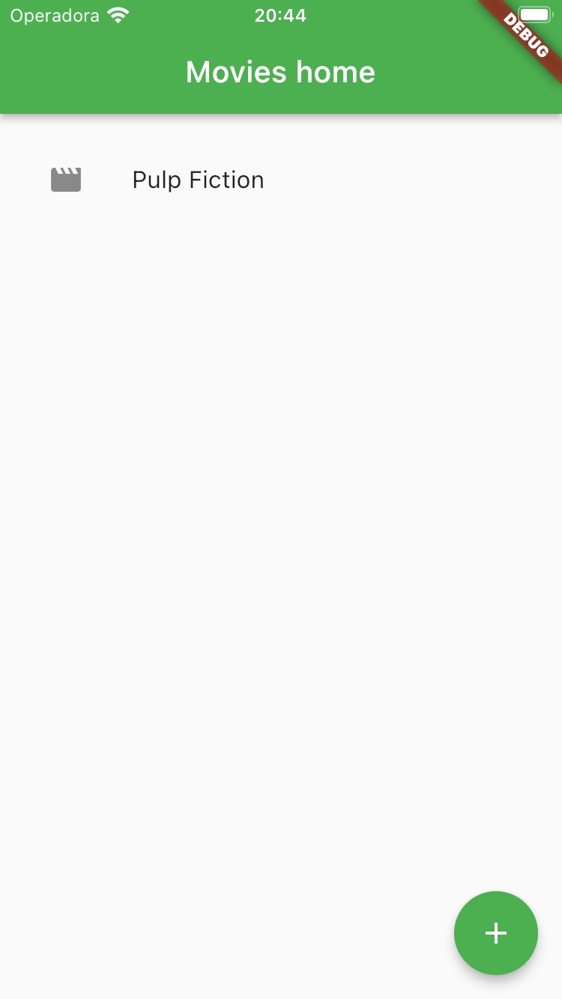

## Exercicios

Concluindo a matéria, e para melhor consolidação dos conhecimentos, vamos realizar alguns exercicios com base no desenvolvido até agora.

1. Como podemos verificar, para a *app* estar mais completa, temos de adicionar funcionalidades que permitam realizar as operações de CRUD normais, *Create, Read, Update e Delete*.
Utilizando o *floating action button* presente no canto inferior direito, crie uma nova rota que permita aceder a uma nova página com um formulário de adição de novos filmes à Firebase.
Mais ajuda [aqui](https://firebase.google.com/docs/firestore/manage-data/add-data).
Este formulário deve seguir o mesmo paradigma que temos utilizado até agora no laboratório.
2. Adicionem uma funcionalidade na AppBar que permita realizar o *logOut* da Firebase. Devem utilizar [este método](https://pub.dev/documentation/firebase_auth/latest/firebase_auth/FirebaseAuth-class.html) da classe já existente no *AuthenticationRepository* .
3. Adicionem um outro *floating action button* no canto inferior esquerdo que permita aceder através de rotas uma nova página, e que nesta seja possível realizar uma pesquisa por nome do filme, realizando múltiplas chamadas à Firebase até obter apenas os filmes relevantes. Mais ajuda [aqui](https://firebase.google.com/docs/firestore/query-data/get-data).
4. Adicione uma nova funcionalidade à lista de filmes em que, ao clicar, irá para uma nova página onde mostra os detalhes todos do filme e não apenas o nome. Devem utilizar um Dialog, mais ajuda [aqui](https://efficientcoder.net/flutter-alert-dialog/).
5. Por último, adicione uma funcionalidade à lista de filmes de realizar um delete de um filme. Mais ajuda [aqui](https://firebase.google.com/docs/firestore/manage-data/delete-data).